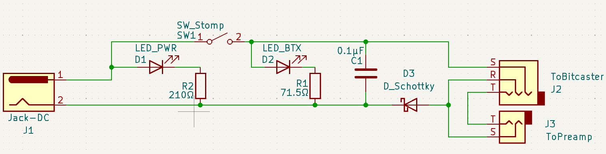

# Bitamp

The Bitamp is a guitar foot pedal intended to pass along the signal of a Bitcaster guitar, while switching on/off the delivery of 5v to a [Bitaxe](https://github.com/skot/bitaxe) embedded in the guitar body.

*current circuit diagram found in the Kicad project in this repo*

On the other end of the Bitamp should be a Bitcaster guitar. The Bitcaster is equipped with a TRS stereo jack instead of the typical TS mono jack, and the Bitamp expects a TRS stereo cable with the following pin assignments:

| Pin | Function |
| :-- | :-- |
| Tip | + Guitar pickup |
| Ring | common ground |
| Sleeve | +5v from power barrel jack |

The Bitamp's output passes along the guitar signal through a standard TS guitar cable, with the following pin assignments:

| Pin | Function |
| :-- | :-- |
| Tip | + Guitar pickup |
| Sleeve | - ground |

The Bitamp foot switch will toggle the delivery of 15 watts of 5V DC through the Sleeve (+) and Ring (-) of of the TRS jack. 

When the foot switch is toggled on, a warm white LED will illuminate and back light a Bitcoin logo cut into the pedal's body. 

The Bitamp also has a blue power indicator LED.